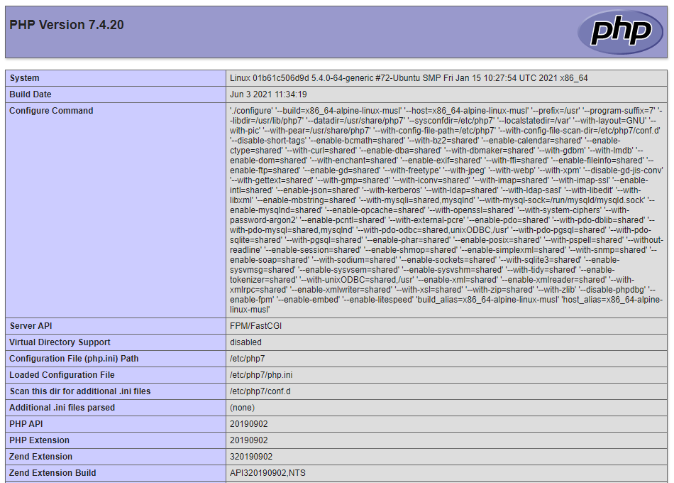
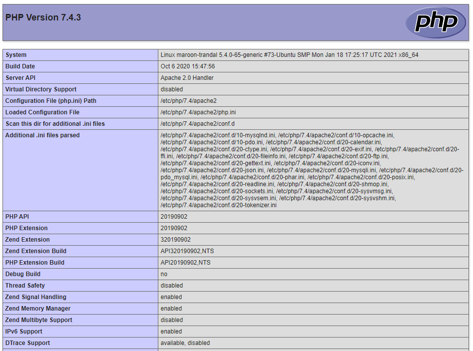

## Тема 2. Использование серверных веб-технологий на платформе PHP

### 1. Развёртывание стека LAMP

#### Часть I. Развёртывание PHP/FPM + NGINX  

  
  

#### Часть II  

  

### 2. Разработка на PHP с помощью GD2 графического интерфейса визуализации данных, полученных с помощью сетевого интерфейса

